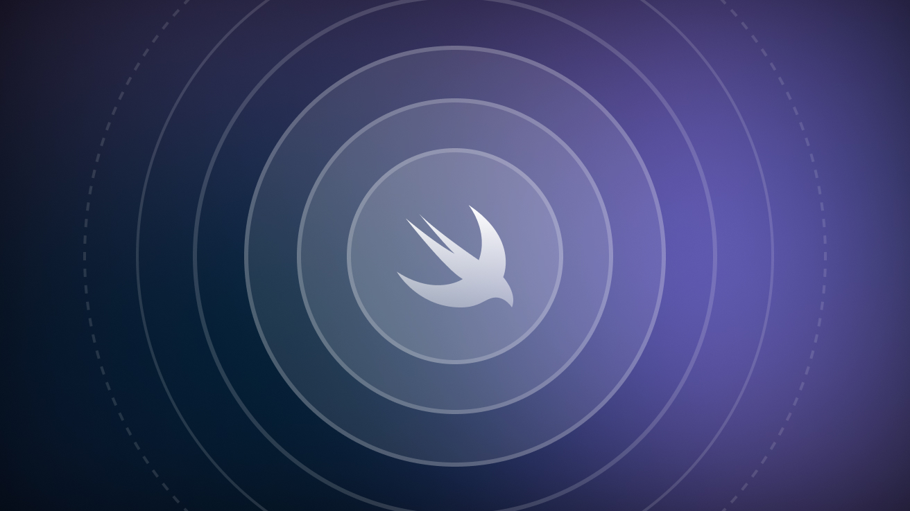

# ObservableTests

This repository contains test code for the article on the Cindori Blog: [Controlling SwiftUI View updates with Observation](https://cindori.com/developer/observation-in-swiftui)

The [Observation](https://developer.apple.com/documentation/observation) framework was introduced with iOS 17.0 and macOS 14.0. If you need to support older OS and want to learn strategies for constraining view updates in SwiftUI without using Observation, stay tuned on our Blog for our next post on this topic.
